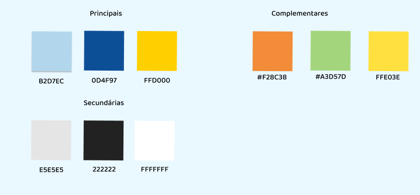
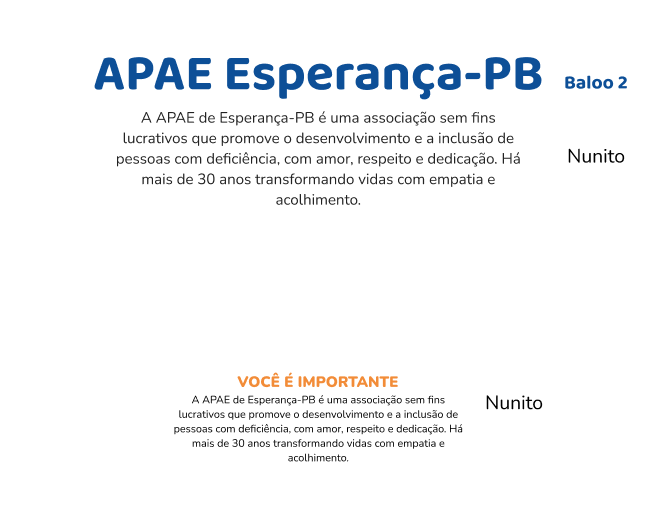
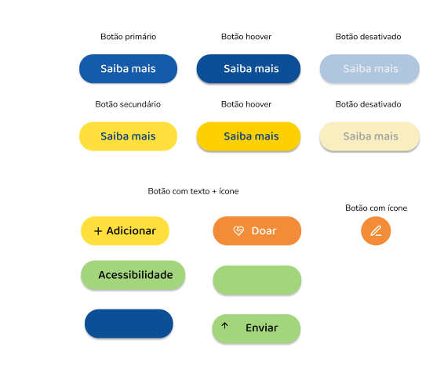
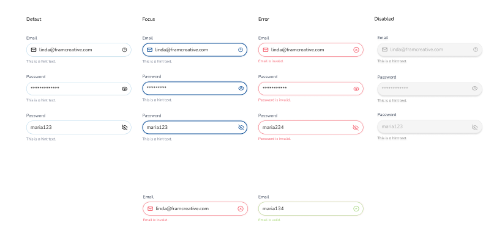

# Definição da Identidade Visual do Site da APAE #12

## 🎨 Definição de Identidade Visual - Site APAE

## Descrição 📝
Essa issue tem como objetivo definir a identidade visual do site da APAE, incluindo paleta de cores, tipografia e elementos gráficos. Essa padronização garantirá que todas as seções do site sigam um estilo coeso, reforçando a imagem institucional da APAE e proporcionando uma experiência visual harmoniosa para os usuários.

## Paleta de Cores e Usos 🎨

### Cores Principais
| Cor | Código | Uso recomendado |
|-----|--------|-----------------|
| [#B2D7EC] Azul claro | `#B2D7EC` | Planos de fundo suaves, seções informativas, botões desativados |
| [#0D4F97] Azul escuro | `#0D4F97` | Cor institucional primária. Títulos, botões principais, ícones importantes |
| [#FFD000] Amarelo | `#FFD000` | Botões secundários, elementos de destaque, alertas positivos, ícones chamativos |

### Cores Secundárias
| Cor | Código | Uso recomendado |
|-----|--------|-----------------|
| [#E5E5E5] Cinza claro | `#E5E5E5` | Bordas, separadores, fundos de input, botões desativados |
| [#222222] Preto | `#222222` | Texto principal, ícones, contraste alto |
| [#FFFFFF] Branco | `#FFFFFF` | Fundos principais, textos invertidos, contraste em botões e cards |

### Cores Complementares
| Cor | Código | Uso recomendado |
|-----|--------|-----------------|
| [#F28C38] Laranja | `#F28C38` | Alertas de atenção, chamadas secundárias, botões de ação com impacto |
| [#A3D57D] Verde claro | `#A3D57D` | Mensagens de sucesso, acessibilidade, selos e informações positivas |
| [#FFE03E] Amarelo pastel | `#FFE03E` | Alternativa para destaques mais suaves, plano de fundo de seções específicas |

### ✅ Boas práticas no uso das cores

- **Contraste:** Sempre garantir contraste suficiente entre texto e fundo (especialmente entre amarelo e branco).
- **Acessibilidade:** Evitar combinações de cores que possam dificultar a leitura por pessoas com deficiência visual (como texto amarelo claro sobre fundo branco).
- **Hierarquia:** Utilizar as cores para indicar **níveis de prioridade** (ex: azul escuro para ações primárias, amarelo para secundárias).
- **Consistência:** Evitar o uso excessivo de cores complementares fora de contextos específicos como alertas, destaques ou mensagens específicas.

### ✅ Análise de Acessibilidade das Escolhas Visuais

#### 🎨 **1. Paleta de Cores**

| Tipo | Cor | Hex | Uso Atual | Avaliação de Acessibilidade |
| --- | --- | --- | --- | --- |
| Principal | Azul claro | `#B2D7EC` | Fundo de elementos secundários | ✅ Bom para fundo, mas **não ideal para texto** |
| Principal | Azul escuro | `#0D4F97` | Botões principais, destaque | ✅ Excelente contraste com branco (AAA) |
| Principal | Amarelo forte | `#FFD000` | Botões secundários | ⚠️ Contraste com branco é **insuficiente** (melhor usar com preto) |
| Complementar | Laranja | `#F28C38` | Elementos visuais informativos | ✅ Funciona bem com textos escuros |
| Complementar | Verde | `#A3D57D` | Ícones, destaques suaves | ⚠️ Com branco tem contraste fraco (use preto) |
| Complementar | Amarelo claro | `#FFE03E` | Destaques de fundo | ⚠️ Usar com preto para garantir contraste |
| Secundária | Cinza claro | `#E5E5E5` | Botões neutros, fundo de cards | ⚠️ Não usar com texto cinza escuro ou branco |
| Secundária | Preto | `#222222` | Títulos, textos principais | ✅ Excelente com branco e tons claros |
| Secundária | Branco | `#FFFFFF` | Fundo, textos sobre cores escuras | ✅ Excelente em contraste com azul escuro ou preto |

#### 📌 **Sugestões**:

- Sempre usar **texto preto (`#222222`)** sobre tons claros (amarelo, cinza, verde).
- Evitar combinações como `#FFD000 + branco` e `#A3D57D + branco`, pois **não atingem contraste mínimo recomendado (4.5:1)**.

## Tipografia

### Escolher a tipografia para títulos, textos e botões

- **Títulos (H1, H2)** → `Baloo 2`, pesos bold
- **Texto comum / parágrafos** → `Nunito`, pesos regular ou semi-bold

**hierarquia:**

| Elemento | Peso | Tamanho | Estilo / Uso recomendado |
| --- | --- | --- | --- |
| **Títulos (H1)** | Bold | 36px | Para títulos principais em páginas e seções. Impacto e clareza. |
| **Subtítulos (H2)** | SemiBold | 24px | Para títulos secundários, seções internas. |
| **Parágrafos** | Regular | 16px | Corpo do texto em páginas informativas. |
| **Textos de apoio** | Light | 14px | Mensagens explicativas, rodapés, rótulos. |
| **Botões** | SemiBold | 16px | Todos os botões devem manter este peso e tamanho, com letras maiúsculas ou capitalizadas. |

### Em relação a tipográfia (Acessibilidade)

- **Títulos:** Em **bold** e tamanhos grandes → ✅ **Alta legibilidade e impacto visual**
- **Textos corridos:** Peso regular, espaçamento adequado → ✅ **Fácil leitura**
- **Botões:** Negrito, contraste bom com o fundo (quando sobre azul ou cinza escuro) → ✅ **Boa leitura e foco**
- **Capitalização:** Correta (não tudo em maiúsculas) → ✅ **Boa prática de usabilidade**

📌 **Sugestões**:

- Mantenha o uso de **peso e hierarquia visual** para facilitar a navegação por leitores de tela.
- Evitar textos em cores claras sobre fundos coloridos — sempre manter contraste adequado (pelo menos 4.5:1).

## Botões 

### Botão Primário
- **Cor de fundo:** Azul (#004EA8)
- **Cor do texto:** Branco
- **Borda:** Arredondada
- **Estado normal:** "Saiba mais"
- **Hover:** Azul mais escuro (#003B82 aprox.)
- **Desativado:** Azul claro com opacidade + texto cinza claro

### Botão Secundário
- **Cor de fundo:** Amarelo (#FFD600)
- **Cor do texto:** Preto
- **Estado normal:** "Saiba mais"
- **Hover:** Amarelo escuro (#FFC400 aprox.)
- **Desativado:** Bege claro com sombra e texto desativado

### Botões com Ícone + Texto
- **+ Adicionar**
  - Fundo: Amarelo
  - Ícone de adição à esquerda
- **Doar**
  - Fundo: Laranja (#F28C3A)
  - Ícone de coração
- **Acessibilidade**
  - Fundo: Verde claro
  - Sem ícone
- **Enviar**
  - Fundo: Verde claro
  - Ícone de seta para cima

### Botão com Ícone
- Botão circular com fundo laranja e ícone branco (ex: lápis para editar)

---

## Inputs

| Estado      | Estilo                                                                 |
|-------------|------------------------------------------------------------------------|
| **Default** | Borda cinza, ícone no lado esquerdo, texto de dica abaixo (cinza claro) |
| **Focus**   | Borda azul (#004EA8), ícone e texto destacados                          |
| **Error**   | Borda vermelha (#E53935), mensagem de erro abaixo em vermelho          |
| **Disabled**| Fundo e texto acinzentados, cursor não interativo                      |
| **Success** | Borda verde claro, texto de feedback positivo abaixo                   |

### Observações:
- Todos os campos têm ícone à esquerda (email) ou à direita (olho no password)
- Os estados devem seguir a cor predominante correspondente (azul, vermelho, cinza ou verde)
- Os campos de senha mantêm o comportamento de ocultar/exibir com o ícone de "olho"

## Logos e icones 

## Diretrizes de Acessibilidade Complementares

Para garantir que o site seja acessível para todos os públicos, incluindo pessoas com deficiência visual, cognitiva ou com baixa visão, adotar as seguintes diretrizes:

#### ✅ Evitar blocos extensos de texto
Utilize subtítulos, listas e espaçamento entre parágrafos para facilitar a leitura e escaneabilidade.

#### ✅ Evite uso exclusivo de cor para transmitir informação
Exemplo: erros de formulário devem ter também ícones ou texto de apoio ("Campo obrigatório").

#### ✅ Tamanho mínimo de fonte recomendada
- 16px para parágrafos.
- 24px para títulos secundários.

#### ✅ Linhas com espaçamento de 1.5 para textos longos.

#### ✅ Não usar fontes decorativas ou cursivas
Priorize legibilidade.

#### ✅ Evite animações rápidas ou piscantes
Evite animações que possam causar desconforto visual ou gatilhos em usuários com epilepsia fotossensível.

---

### Compatibilidade com leitores de tela

Adicionar um pequeno item que reforce que todos os elementos visuais (ícones, botões, inputs) devem ter:

- `aria-label` ou `aria-labelledby` apropriado.
- Ícones puramente decorativos com `aria-hidden="true"`.

---

###  Modo alto contraste ou contraste reverso

Sugerir que o site inclua uma funcionalidade de acessibilidade que permita:

- Alternar para modo alto contraste (ex: fundo preto e texto branco). DARKMODE
- Ou um modo com contraste reverso, muito útil para usuários com deficiência visual severa.

Essa opção pode ser ativada com um botão flutuante (com ícone de acessibilidade ♿ ou olho 👁).

---

### “Checklist de Acessibilidade Visual”

| Elemento                                               | Verificado | Observações                         |
|--------------------------------------------------------|------------|-------------------------------------|
| Contraste mínimo 4.5:1 para textos                     | ✅         | Conforme WCAG 2.1                   |
| Uso coerente de cores para hierarquia                  | ✅         | Azul escuro: primário               |
| Alternativas visuais para mensagens de erro            | ✅         | Cores + texto                       |
| Tipografia legível e escalável                         | ✅         | Fontes sem serifa                   |
| Espaçamento adequado entre textos e elementos          | ✅         | 1.5 em parágrafos                   |
V