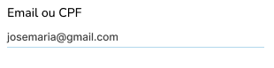
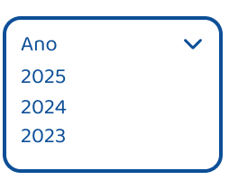
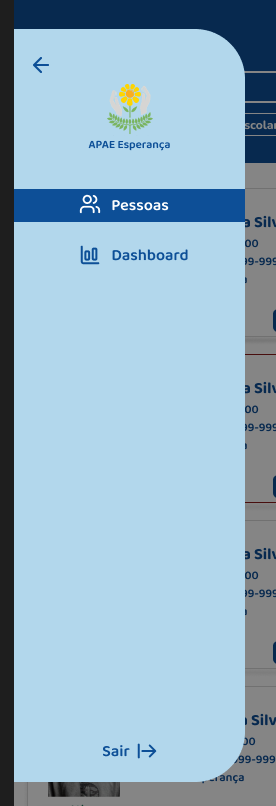
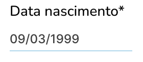
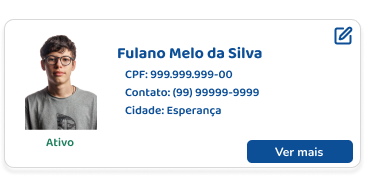
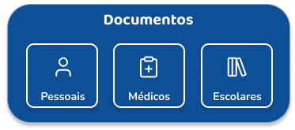
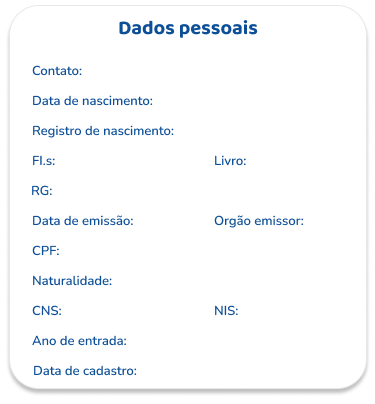

# Documentação da Biblioteca de Componentes - Shadcn

## Objetivo

Esta documentação tem como finalidade padronizar a utilização de componentes no projeto da APAE, especificando quais serão aproveitados da biblioteca Shadcn e quais serão desenvolvidos do zero, garantindo coesão visual e consistência no código.

---

## Componentes Aproveitados do Shadcn

Aqui estão os componentes do Shadcn que vamos utilizar diretamente ou com pequenas alterações.

### 1. Tabs

- **Imagem do Protótipo da APAE:**

  

  **Link Shadcn para adaptação:**

  [Tabs](https://ui.shadcn.com/docs/components/tabs)

---

### 2. Select

- **magem do Protótipo da APAE:**

  

  **Link Shadcn para adaptação:**

  [Select](https://ui.shadcn.com/docs/components/select)

---

### 3. Input

- **Imagem do Protótipo da APAE:**
 
  

  **Link Shadcn para adaptação:**

  [Input](https://ui.shadcn.com/docs/components/input)

---

### 4. Combobox

- **Imagem do Protótipo da APAE:**

  

  **Link Shadcn para adaptação:**

  [Combobox](https://ui.shadcn.com/docs/components/combobox)

---

### 5. Sidebar

- **Imagem do Protótipo da APAE:**

  

  **Link Shadcn para adaptação:**

  [Sidebar](https://ui.shadcn.com/docs/components/sidebar)

---

### 6. Radio Group

- **Imagem do Protótipo da APAE:**

  

  **Link Shadcn para adaptação:**

  [Radio Group](https://ui.shadcn.com/docs/components/radio-group)

---

### 7. Date Picker

- **Imagem do Protótipo da APAE:**

  

  **Link Shadcn para adaptação:**

  [Date Picker](https://ui.shadcn.com/docs/components/date-picker)

---

## Componentes a Desenvolver do Zero

Aqui estão os componentes que precisaremos criar completamente do zero.

### 1. Card para visualizar pessoa cadastrada

- **Imagem do Protótipo da APAE:**

  

---

### 2. Card para visualizar documentos

- **Imagem do Protótipo da APAE:**

  

---

### 3. Card de formulário para cadastrar pessoas

- **Imagem do Protótipo da APAE:**

  

---

### 2. FAB (Floating Action Button)

- **Imagem do Protótipo da APAE:**

  

---

## Considerações Finais

- Poderemos aproveitar determinados componentes da biblioteca Shadcn, conforme exemplificado acima.
- Os componentes aproveitados poderão ser customizados ou alterados conforme a necessidade do projeto (como, por exemplo, os campos de input). 
- Esta documentação será atualizada de acordo com o andamento do desenvolvimento.

--- 
